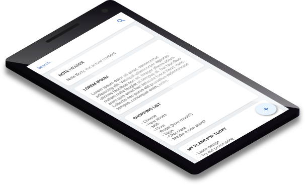

# MagNotefy 

A minimalistic note-taking app where the search-field is your primary form of navigation.

- [MagNotefy](#magnotefy)
	- [Figma Design](#figma-design)
	- [Building](#building)
	- [Documentation for developers](#documentation-for-developers)

## Figma Design

Figma file: https://www.figma.com/file/U4lWB4cHRDm6enZXMQ28n7/MagNotefy

The main focus of the design was the Search field, which was inspired by Microsoft Cortana and screenshots of Windows 10X.  
The design went over a lot of iterations to find a good balance between the light and dark theme until it settled on a dark theme inspired by Microsoft Outlook ([Designing Dark Mode](https://medium.com/microsoft-design/designing-dark-mode-31400530787a)) and OneNote for Android, and a light theme inspired by Microsoft ToDo for Android.



## Building

To build the MagNotefy App you first have to clone this repository and recreate the project folders for android and ios (and even other platforms depending on your flutter setup) using this command:

```shell
flutter create .
```
  
To generate the app icons, execute

```shell
flutter pub run flutter_launcher_icons:main
```

After that, you can build the Flutter project as usual (e.g. `flutter run`).

## Documentation for developers

The folder and file structure and other technical details are explained in the [documentation](doc/Main.md).